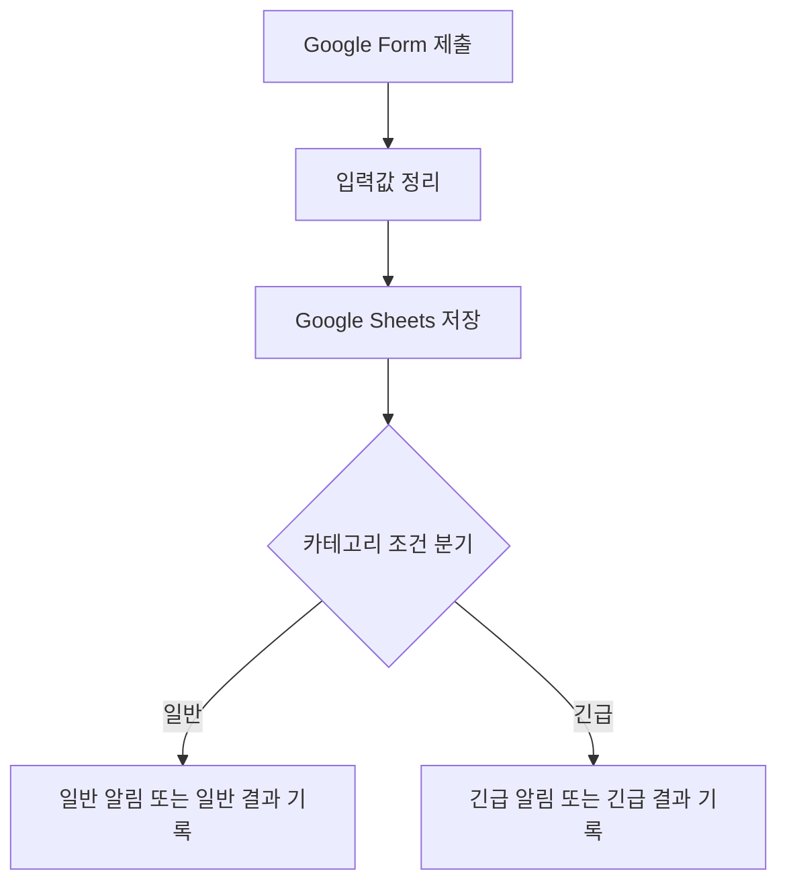

# 프로젝트 1. Make vs n8n 자동화 도구 비교 보고서

## 1. 프로젝트 개요

본 프로젝트는 동일한 단순 업무 자동화 시나리오를 **Make**와 **n8n** 두 가지 자동화 도구로 구현하고 비교 분석한 보고서이다.

사용자가 **Google Form**에 문의를 제출하면 입력값을 정리하고 **Google Sheets**에 저장한 뒤, 카테고리에 따라 **일반/긴급 처리 경로**로 분기하는 구조를 동일하게 설계하였다.

---

## 2. 공통 워크플로우 구조

두 도구 모두 아래와 같은 동일한 구조를 기준으로 구현한다.



### 2.1 입력 항목

| 항목 | 설명 |
|---|---|
| 이름 | 문의자 이름 |
| 이메일 | 문의자 이메일 주소 |
| 카테고리 | 일반 또는 긴급 |
| 문의내용 | 사용자가 입력한 상세 문의 내용 |
| 제출시간 | Google Form 또는 자동화 도구에서 기록되는 시간 |

### 2.2 공통 요구사항 충족 구조

| 요구사항 | 구현 내용 |
|---|---|
| Trigger 1개 이상 | Google Form 제출 또는 Webhook Trigger |
| Action 2개 이상 | 입력값 정리, Google Sheets 저장, 일반/긴급 결과 기록 |
| 조건 분기 1개 이상 | 카테고리 기준 일반/긴급 분기 |
| 각 분기 실행 확인 | 일반/긴급 테스트 요청을 각각 1회 실행하여 응답 결과 확인 |

---

## 3. 사용한 도구 이름

| 도구 | 사용 목적 |
|---|---|
| Google Form | 사용자 입력 화면 |
| Google Sheets | 제출 데이터 저장 |
| Make | SaaS 기반 자동화 시나리오 구현 및 비교 대상 |
| n8n | 셀프호스팅 기반 자동화 워크플로우 구현 및 비교 대상 |

---

## 4. Make 구현 과정 요약

Make에서는 Google Forms 또는 Google Sheets 모듈을 시작점으로 하여 시나리오를 구성한다.

```text
Google Form 제출 또는 Google Sheets 새 행 감지
→ 입력값 매핑
→ Google Sheets 행 추가/정리
→ Router로 카테고리 조건 분기
→ 일반/긴급 경로별 알림 또는 결과 기록
```

### 4.1 Make 구성 포인트

1. Google Form 응답을 Google Sheets에 연결한다.
2. Make에서 Google Sheets의 새 행을 Trigger로 감지한다.
3. 이름, 이메일, 카테고리, 문의내용 필드를 매핑한다.
4. Router를 추가하여 카테고리가 `긴급`인지 `일반`인지 분기한다.
5. 각 분기에서 알림 발송 또는 결과 기록 모듈을 실행한다.

---

## 5. n8n 구현 과정 요약

n8n에는 실제 동작하는 제출용 워크플로우를 생성하였다.

### 5.1 n8n 워크플로우 정보

| 항목 | 내용 |
|---|---|
| 워크플로우 이름 | `[과제] 프로젝트1 - Google Form 분기 저장 자동화 (n8n)` |
| n8n 워크플로우 ID | `3aKejBkfh3mRP22S` |
| 상태 | 활성화됨 |
| Webhook Path | `project1-google-form-to-sheet-simple` |
| Production Webhook URL | `https://n8n.chanuk.theworkpc.com/webhook/project1-google-form-to-sheet-simple` |
| 워크플로우 JSON | `assets/project1/n8n-project1-simple-workflow.json` |

### 5.2 n8n 노드 구성

```text
[P1] Google Form 제출 Webhook
→ [P1] 입력값 정리
→ [P1] Google Sheets에 행 추가
→ [P1] 카테고리 조건 분기
  ├─ 긴급 → [P1] 긴급 결과 기록
  └─ 일반 → [P1] 일반 결과 기록
→ [P1] 저장 및 분기 완료 응답
```

### 5.3 n8n 구현 결과

n8n 워크플로우는 실제 활성화되어 있으며 일반/긴급 분기 테스트를 각각 1회 실행하였다.

| 테스트 | 입력 카테고리 | 실행 분기 | 결과 |
|---|---|---|---|
| 일반 분기 테스트 | 일반 | 일반 결과 기록 | 성공 |
| 긴급 분기 테스트 | 긴급 | 긴급 결과 기록 | 성공 |

일반 분기 응답 예시:

```json
{
  "success": true,
  "message": "Google Sheets 저장 및 카테고리 분기 완료",
  "name": "테스트-일반",
  "category": "일반",
  "branch": "일반",
  "result": "일반 문의로 분류되어 일반 처리 경로를 실행함"
}
```

긴급 분기 응답 예시:

```json
{
  "success": true,
  "message": "Google Sheets 저장 및 카테고리 분기 완료",
  "name": "테스트-긴급",
  "category": "긴급",
  "branch": "긴급",
  "result": "긴급 문의로 분류되어 긴급 처리 경로를 실행함"
}
```

---

## 6. MCP 연동 관점 정리

Make와 n8n은 모두 MCP 또는 API 기반으로 AI 도구와 연결할 수 있다. 따라서 “MCP는 n8n만 가능하다”가 아니라, **두 도구 모두 AI 도구 연동이 가능하지만 활용 방식과 제약이 다르다**고 정리하는 것이 정확하다.

| 항목 | Make | n8n |
|---|---|---|
| MCP 지원 | Make MCP Server 제공 | n8n MCP/API 연동 가능 |
| AI 도구 활용 | MCP 서버에 노출된 시나리오/도구를 실행하거나 권한 범위 내에서 관리 가능 | 워크플로우 조회, 수정, 실행, 로그 확인을 API/MCP로 비교적 직접 처리 가능 |
| 제약 | MCP 토큰 권한, Make 플랜, 노출된 도구 수에 따라 가능 작업이 달라짐 | 셀프호스팅 설정, API Key, Credential 관리가 필요함 |
| 과제 적용 | Make 시나리오를 만들고 Router/Filter 실행 결과를 캡처하여 비교 | 실제 n8n 워크플로우를 생성·수정하고 일반/긴급 분기 테스트까지 실행 |

---

## 7. Make와 n8n 비교 분석

| 비교 항목 | Make | n8n |
|---|---|---|
| UI/UX | 초보자도 쉽게 이해할 수 있는 시각적 Scenario UI | 노드 기반 UI이며 데이터 흐름을 세밀하게 확인 가능 |
| 설정 난이도 | SaaS 로그인 후 바로 시작 가능해 낮음 | 셀프호스팅, Credential, Webhook 설정 이해가 필요함 |
| 연동 서비스 범위 | 주요 SaaS 앱 연동이 매우 편리함 | HTTP Request, Code Node로 커스텀 API 연동에 강함 |
| 무료 플랜/비용 | 무료 플랜 이후 작업량이 늘면 과금 부담 가능 | 직접 호스팅 시 사용량 과금 없이 운영 가능 |
| 조건 분기 방식 | Router와 Filter를 UI에서 쉽게 추가 | Switch/IF 노드로 세밀한 조건 분기 가능 |
| 실행 로그 확인 | 실행 History에서 모듈별 결과 확인 | Execution 로그에서 각 노드 입력/출력 데이터 확인 |
| 유지보수성 | 단순 자동화는 관리가 쉬움 | 복잡한 자동화와 장기 운영에 유리함 |
| 확장성 | 제공 모듈과 HTTP/API, MCP 연동으로 확장 가능 | Code Node, Webhook, HTTP Request, MCP로 자유롭게 확장 가능 |
| MCP/AI 도구 연동 | Make MCP Server를 통해 외부 AI 도구가 Make 시나리오 실행·조회·관리 기능을 사용할 수 있음. 단, 토큰 권한과 노출된 도구 범위에 따라 가능 작업이 달라짐 | n8n MCP/API를 통해 외부 AI 도구가 워크플로우를 조회·수정하거나 실행 상태를 확인하기 쉬움 |

---

## 8. 각 도구의 장단점

### 8.1 Make 장점

- 가입 후 바로 사용할 수 있어 초기 진입 장벽이 낮다.
- Google Sheets, Gmail, Slack 등 SaaS 앱 연결이 쉽다.
- Router/Filter 설정이 직관적이다.
- 간단한 업무 자동화를 빠르게 만들기 좋다.
- Make MCP Server를 사용하면 AI 도구와 연결하여 시나리오 실행, 조회, 일부 관리 작업을 자동화할 수 있다.

### 8.2 Make 단점

- 사용량이 많아지면 비용이 늘어날 수 있다.
- 복잡한 예외 처리나 커스텀 로직은 관리가 어려워질 수 있다.
- 셀프호스팅이나 내부 서버 통제에는 적합하지 않다.
- MCP를 사용하더라도 토큰 권한, Make 플랜, 노출된 도구 범위에 따라 AI가 직접 만들거나 수정할 수 있는 작업이 제한될 수 있다.

### 8.3 n8n 장점

- 직접 호스팅하면 사용량 기반 과금 부담이 적다.
- Webhook, Code Node, HTTP Request를 활용해 커스텀 로직을 만들기 쉽다.
- 실행 로그에서 각 노드의 입력/출력 데이터를 자세히 확인할 수 있다.
- MCP/API 연동 시 AI가 워크플로우 노드를 직접 조회하고 수정할 수 있어 바이브코딩 방식에 적합하다.

### 8.4 n8n 단점

- 초기 서버, 도메인, Credential 설정이 Make보다 어렵다.
- 노드별 데이터 구조를 이해해야 디버깅이 쉽다.
- 셀프호스팅 시 백업, 보안, 업데이트를 직접 관리해야 한다.

---

## 9. 어떤 상황에서 적합한가

| 상황 | 적합한 도구 | 이유 |
|---|---|---|
| 빠르게 자동화를 만들고 싶을 때 | Make | SaaS 기반이라 설정이 빠르고 UI가 쉽다. |
| 비개발자가 간단한 업무를 자동화할 때 | Make | Router/Filter와 앱 연결이 직관적이다. |
| 사용량이 많고 비용을 줄이고 싶을 때 | n8n | 셀프호스팅 시 사용량 과금 부담이 적다. |
| 복잡한 API 연동이나 커스텀 로직이 필요할 때 | n8n | HTTP Request와 Code Node 사용이 자유롭다. |
| AI가 워크플로우를 실행·조회하는 방식이 필요할 때 | Make, n8n | 두 도구 모두 MCP 연동이 가능하다. Make는 Make MCP Server의 노출 도구/권한 범위 내에서, n8n은 MCP/API를 통해 자동화할 수 있다. |
| AI가 워크플로우 내부 노드를 세밀하게 수정하는 방식이 필요할 때 | n8n | 현재 구성에서는 n8n 쪽이 API/MCP 기반 워크플로우 편집과 검증을 더 직접적으로 수행하기 쉽다. |

---

## 10. 구현 화면 및 실행 결과 캡처

| 구분 | 파일 |
|---|---|
| Make 워크플로우 구성 화면 | `assets/project1/make-workflow.png` |
| Make 실행 결과 화면 | `assets/project1/make-result.png` |
| n8n 워크플로우 구성 화면 | `assets/project1/n8n-workflow.png` |
| n8n 일반/긴급 분기 실행 결과 화면 | `assets/project1/n8n-result.png` |
| Google Sheets 저장 결과 화면 | `assets/project1/google-sheets-result.png` |

---

## 11. 결론

이번 프로젝트에서는 **Google Form 제출 → 입력값 정리 → Google Sheets 저장 → 카테고리 조건 분기 → 일반/긴급 결과 기록**이라는 동일한 구조를 Make와 n8n 관점에서 비교하였다.

Make는 빠른 설정과 쉬운 UI가 장점이므로 간단한 SaaS 자동화에 적합하다. 또한 Make도 MCP Server를 통해 AI 도구와 연결할 수 있으므로, MCP 연동 자체는 n8n만의 기능이 아니다. 다만 Make는 MCP 토큰 권한과 노출된 도구 범위에 따라 가능한 작업이 달라진다. n8n은 초기 설정은 더 필요하지만 직접 호스팅, 세밀한 로그 확인, 커스텀 코드, API/MCP 기반 워크플로우 편집이 쉬워 장기적으로 확장 가능한 자동화에 더 적합하다.
