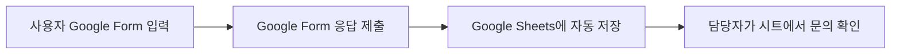

# 프로젝트 1. Google Form 입력 → Google Sheets 저장 자동화

## 1. 프로젝트 개요

본 프로젝트는 사용자가 **Google Form**에 문의 내용을 입력하면 응답 데이터가 **Google Sheets**에 자동으로 누적되도록 만드는 가장 단순한 업무 자동화이다.

복잡한 AI 분기나 메일 발송은 제외하고, 실제 현업에서 자주 필요한 “폼 응답 수집 → 스프레드시트 정리” 흐름에 집중하였다.

---

## 2. 자동화 목표

반복적으로 들어오는 문의 내용을 사람이 직접 복사하지 않고, Google Form 응답을 Google Sheets에 자동 저장한다.



---

## 3. 입력 항목

| 항목 | 설명 |
|---|---|
| 이름 | 문의자 이름 |
| 이메일 | 문의자 이메일 주소 |
| 카테고리 | 문의 유형 또는 구분 |
| 문의내용 | 사용자가 입력한 상세 문의 내용 |
| 제출시간 | Google Form 또는 n8n에서 자동 기록되는 시간 |

---

## 4. Google Form 구현 방식

Google Form에서는 아래 항목을 질문으로 만든다.

1. 이름
2. 이메일
3. 카테고리
4. 문의내용

Form 상단의 **응답** 탭에서 Google Sheets 아이콘을 클릭하면 응답 대상 스프레드시트를 연결할 수 있다. 이후 사용자가 폼을 제출할 때마다 시트에 새 행이 자동으로 추가된다.

```text
Google Form
→ 응답 탭
→ Google Sheets 연결
→ 제출 응답 자동 누적
```

---

## 5. n8n 구현

제출용으로 n8n에도 같은 목적의 단순 워크플로우를 생성하였다.

### 5.1 n8n 워크플로우 정보

| 항목 | 내용 |
|---|---|
| 워크플로우 이름 | `[과제] 프로젝트1 - Google Form 입력 → Google Sheets 저장 (단순형)` |
| n8n 워크플로우 ID | `3aKejBkfh3mRP22S` |
| 상태 | 활성화됨 |
| Webhook Path | `project1-google-form-to-sheet-simple` |
| Production Webhook URL | `https://n8n.chanuk.theworkpc.com/webhook/project1-google-form-to-sheet-simple` |
| 저장 대상 | Google Sheets |

### 5.2 n8n 노드 구성

```text
[P1] Google Form 제출 Webhook
→ [P1] 입력값 정리
→ [P1] Google Sheets에 행 추가
→ [P1] 저장 완료 응답
```

### 5.3 n8n 처리 내용

1. Webhook으로 폼 데이터를 받는다.
2. 이름, 이메일, 카테고리, 문의내용 값을 정리한다.
3. Google Sheets에 새 행을 추가한다.
4. 저장 완료 JSON 응답을 반환한다.

### 5.4 n8n 워크플로우 JSON

워크플로우 구조는 아래 파일에도 저장하였다.

```text
assets/project1/n8n-project1-simple-workflow.json
```

---

## 6. 테스트 예시

아래와 같은 JSON이 들어오면 Google Sheets에 한 줄이 추가된다.

```json
{
  "이름": "홍길동",
  "이메일": "hong@example.com",
  "카테고리": "일반",
  "문의내용": "서비스 이용 방법을 알고 싶습니다."
}
```

응답 예시는 다음과 같다.

```json
{
  "success": true,
  "message": "Google Sheets 저장 완료",
  "receivedName": "홍길동",
  "category": "일반"
}
```

---

## 7. 구현 화면 캡처

| 구분 | 파일 |
|---|---|
| Google Form 구성 화면 | `assets/project1/google-form.png` |
| Google Sheets 응답 저장 화면 | `assets/project1/google-sheets-result.png` |
| n8n 워크플로우 구성 화면 | `assets/project1/n8n-workflow.png` |
| n8n 실행 결과 화면 | `assets/project1/n8n-result.png` |

---

## 8. 결론

프로젝트 1은 복잡한 자동화보다 **입력받은 데이터를 정확하게 기록하는 기본 자동화**에 초점을 맞추었다.

Google Form과 Google Sheets만으로도 충분히 실용적인 자동화가 가능하며, n8n을 함께 사용하면 Webhook, 외부 API, 추가 알림 등으로 확장할 수 있다.
