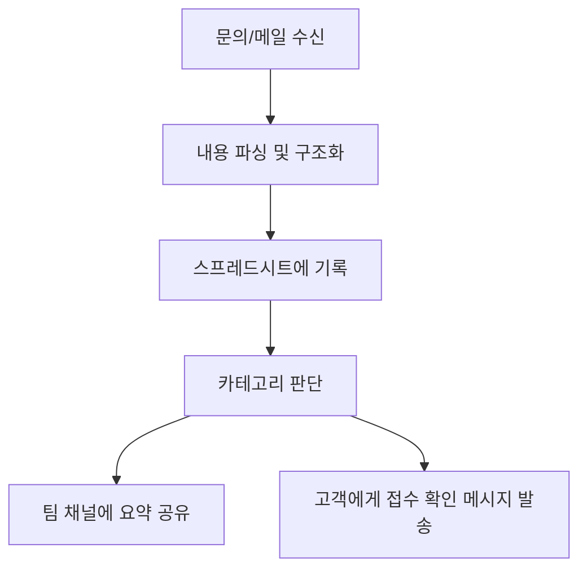
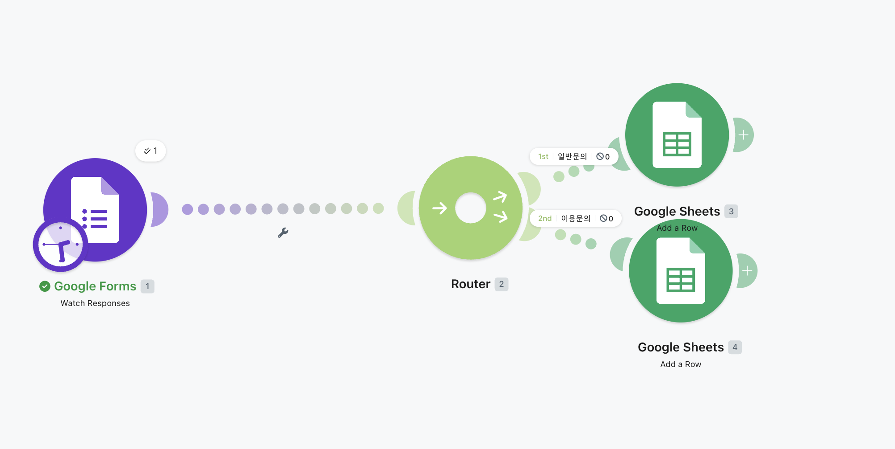
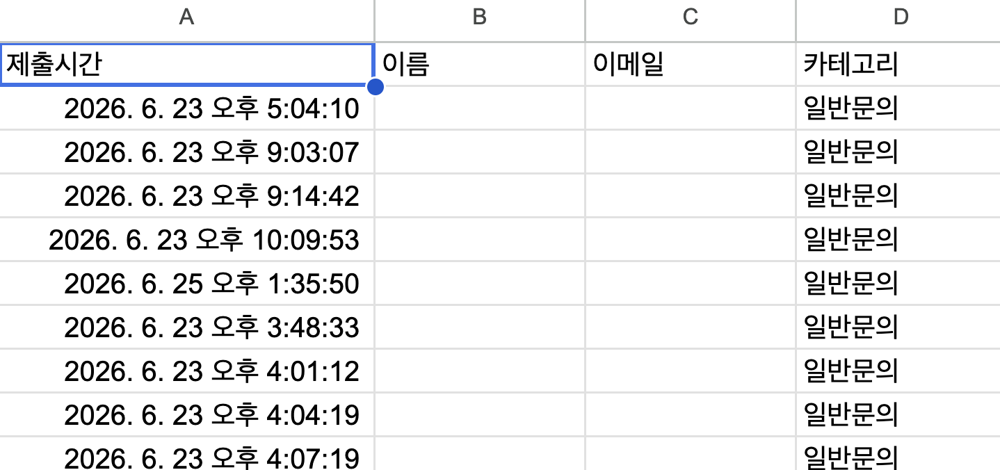
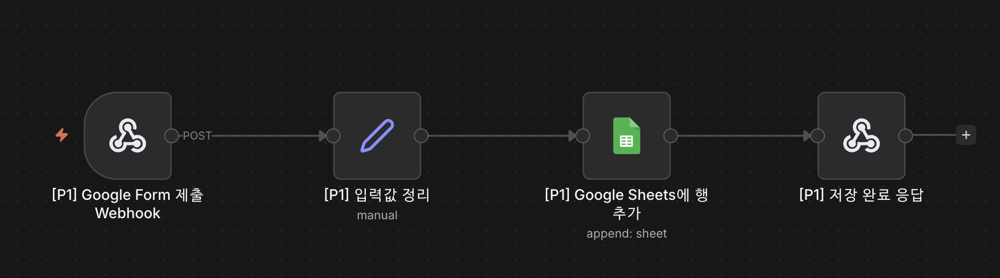

# 프로젝트 1. 자동화 도구 비교 구현 보고서

## 1. 프로젝트 개요

본 프로젝트는 동일한 반복 업무 자동화 시나리오를 **Make**와 **n8n** 두 가지 자동화 도구로 각각 구현하고, 구현 과정과 실행 결과를 비교 분석하는 것을 목적으로 한다.

비교 대상 업무는 다음과 같다.

> 매일 또는 수시로 들어오는 문의/메일 내용을 확인하여 필요한 정보를 추출하고, 스프레드시트에 기록한 뒤 팀 채널에 요약 내용을 공유하는 업무

이 업무는 사람이 직접 수행하면 다음과 같은 반복 작업이 발생한다.

1. 문의 또는 메일 확인
2. 이름, 이메일, 카테고리, 문의 내용 추출
3. 스프레드시트에 행 추가
4. 팀 채널 또는 담당자에게 알림 전송
5. 필요 시 접수 완료 메시지 발송

따라서 자동화 도구를 이용해 위 과정을 워크플로우로 구성하였다.

---

## 2. 구현 도구

| 도구 | 유형 | 사용 목적 |
|---|---|---|
| Make | SaaS 기반 자동화 플랫폼 | 빠른 시각적 시나리오 구성 및 외부 서비스 연동 |
| n8n | 오픈소스/셀프호스팅 자동화 플랫폼 | Webhook, AI Agent, Google Sheets, Gmail, Discord 연동 자동화 |

---

## 3. 동일 워크플로우 시나리오

### 3.1 자동화 목표

문의가 들어오면 자동으로 내용을 정리하고 기록 및 알림까지 처리한다.

### 3.2 공통 워크플로우



### 3.3 주요 데이터 항목

| 항목 | 설명 |
|---|---|
| 이름 | 문의자 이름 |
| 이메일 | 문의자 이메일 주소 |
| 카테고리 | 서비스 이용, 서비스 장애/오류 등 |
| 문의 내용 | 고객이 입력한 상세 내용 |
| 제목 | AI 또는 규칙 기반으로 생성한 문의 제목 |

---

## 4. Make 구현

### 4.1 Make 워크플로우 구성

Make에서는 Scenario를 생성하고 각 서비스를 모듈 단위로 연결하였다.

예시 구성:

```text
Trigger
→ Text Parser 또는 AI 처리 모듈
→ Google Sheets Add a Row
→ Router
→ Email/Discord/Slack 알림
```

### 4.2 Make 구현 화면 캡처



### 4.3 Make 실행 결과 화면 캡처



### 4.4 Make 장점

- 브라우저에서 바로 시나리오를 만들 수 있어 진입 장벽이 낮다.
- Google Sheets, Gmail, Slack 등 SaaS 서비스 연동이 빠르다.
- 모듈 간 데이터 매핑 UI가 직관적이다.
- 간단한 업무 자동화는 코딩 없이 빠르게 구현할 수 있다.

### 4.5 Make 한계

- 사용량이 늘어나면 과금 부담이 커질 수 있다.
- 복잡한 분기, 예외 처리, 커스텀 코드 관리가 길어지면 시나리오 유지보수가 어려워질 수 있다.
- 외부 AI 도구가 워크플로우 내부 노드를 직접 읽고 수정하는 자동화 개발 방식은 n8n보다 제한적이다.
- 셀프호스팅 중심의 완전한 통제권 확보에는 적합하지 않다.

---

## 5. n8n 구현

### 5.1 n8n 워크플로우 구성

n8n에서는 Webhook을 시작점으로 하여 AI Agent, Google Sheets, Gmail, Discord 연동을 구성하였다.

예시 구성:

```text
Webhook
→ AI Agent
→ Structured Output Parser
→ Google Sheets Append Row
→ Switch
→ Gmail
→ Discord Webhook 또는 Discord Bot API
```

### 5.2 n8n 구현 화면 캡처



### 5.3 n8n 실행 결과 화면 캡처


### 5.4 n8n 장점

- 오픈소스 기반이며, 직접 호스팅하면 별도 사용량 과금 없이 무료로 운영할 수 있다.
- 서버, 데이터, 워크플로우 실행 환경을 직접 관리할 수 있어 확장성과 통제력이 높다.
- HTTP Request, Code Node, Webhook 등으로 복잡한 API 연동을 유연하게 처리할 수 있다.
- AI Agent, OpenAI, Gmail, Google Sheets, Discord 등 다양한 노드를 조합할 수 있다.
- MCP가 연결되어 있으면 AI 도구가 n8n 워크플로우를 조회하고 노드를 직접 수정할 수 있다.
- 이 때문에 사람이 UI에서 일일이 노드를 고치지 않아도, 자연어로 요청하면 AI가 노드 구성과 파라미터를 수정하는 **바이브코딩 방식의 자동화 개발**이 가능하다.

### 5.5 n8n 한계

- 직접 호스팅하는 경우 서버 운영, 도메인, SSL, 백업, 보안 설정을 직접 관리해야 한다.
- 초기에 Webhook, Credential, API 권한 설정을 이해해야 한다.
- 노드 버전이나 인증 방식에 따라 디버깅이 필요할 수 있다.
- 복잡한 워크플로우는 실행 로그와 데이터 흐름을 꼼꼼히 확인해야 한다.

---

## 6. 도구 비교 분석

| 비교 항목 | Make | n8n |
|---|---|---|
| 운영 방식 | SaaS 중심 | 클라우드 또는 셀프호스팅 |
| 비용 | 무료 플랜 이후 사용량 기반 과금 가능 | 직접 호스팅 시 무료 운영 가능 |
| 사용 난이도 | 초보자에게 쉬움 | 초기 설정은 필요하지만 확장성이 높음 |
| UI 구성 | 매우 직관적인 시각적 Scenario | 노드 기반 워크플로우 UI |
| 외부 서비스 연동 | SaaS 앱 연동이 매우 편리 | API, Webhook, Code Node로 유연하게 확장 가능 |
| 커스텀 코드 | 제한적 | Code Node로 자유도 높음 |
| AI 기반 수정 | 제한적 | MCP 연동 시 AI가 워크플로우 노드를 직접 수정 가능 |
| 바이브코딩 적합성 | 낮음~보통 | 높음 |
| 데이터 통제 | SaaS 제공 환경 의존 | 자체 서버에서 데이터와 실행 환경 통제 가능 |
| 유지보수 | 간단한 자동화에 유리 | 복잡한 업무 자동화와 장기 운영에 유리 |

---

## 7. 비교 결론

Make는 빠르게 자동화 시나리오를 구성하고 테스트하기에 적합하다. 특히 코딩 경험이 적은 사용자도 시각적 UI를 통해 Google Sheets, Gmail, Slack 등 주요 서비스를 쉽게 연결할 수 있다.

반면 n8n은 초기 설정 난이도는 조금 더 있지만, 직접 호스팅하면 무료로 운영할 수 있고, API 연동과 커스텀 코드 사용이 자유롭다. 특히 MCP가 연결되어 있으면 AI가 워크플로우 노드를 직접 조회하고 수정할 수 있어, 자연어 기반 바이브코딩 방식으로 자동화 워크플로우를 빠르게 개선할 수 있다는 장점이 크다.

따라서 단순하고 빠른 SaaS 자동화에는 Make가 적합하고, 장기적으로 확장 가능한 자동화 시스템이나 AI와 함께 지속적으로 개선하는 자동화 개발에는 n8n이 더 적합하다고 판단하였다.

---

## 8. 제출 체크리스트

| 요구사항 | 충족 여부 | 비고 |
|---|---:|---|
| 동일한 자동화 워크플로우를 2개 이상의 도구로 구현 | ✅ | Make, n8n |
| 각 도구별 워크플로우 구성 화면 캡처 | ✅ | `assets/project1/`에 첨부 |
| 실행 결과 화면 캡처 | ✅ | `assets/project1/`에 첨부 |
| 비교 분석 보고서 | ✅ | 본 Markdown 문서 |
