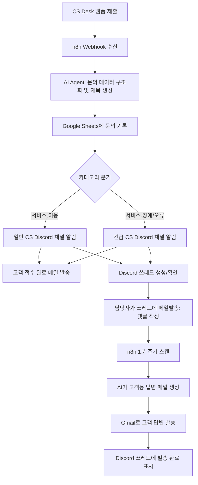
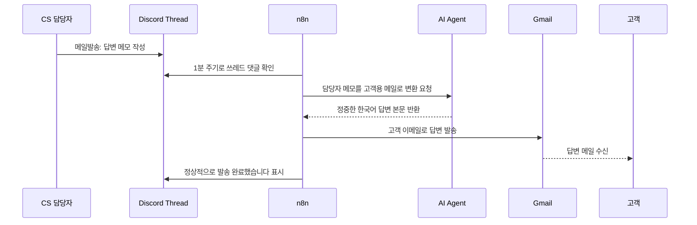
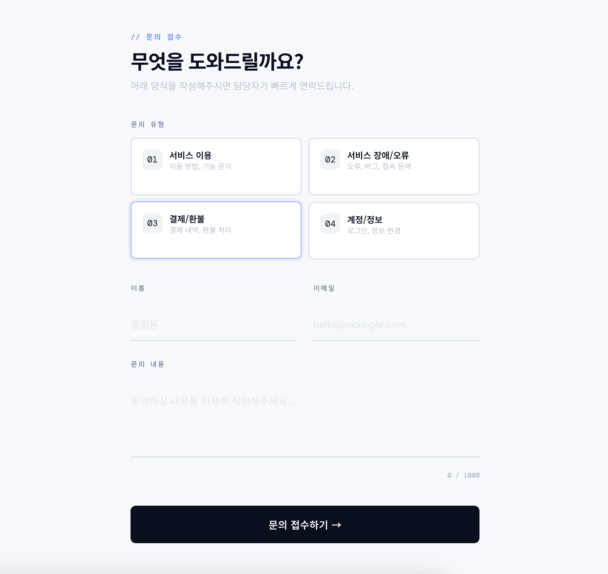
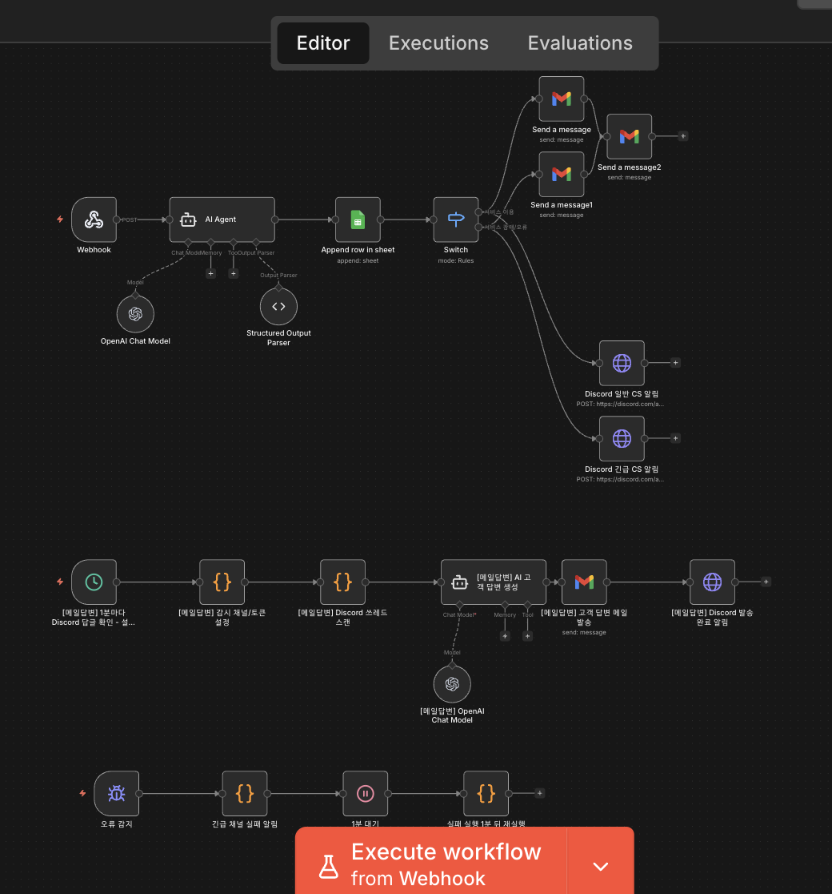
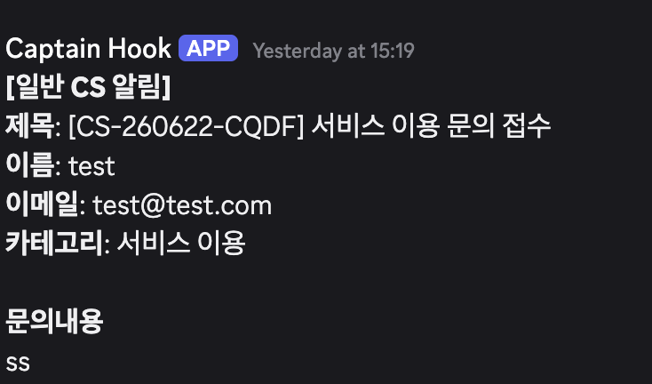
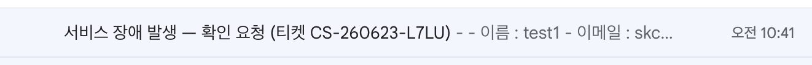

# 프로젝트 2. CS Desk 자동화 설계 및 구현 문서

## 1. 프로젝트 개요

본 프로젝트는 고객 문의 접수와 후속 처리 업무를 자동화하는 **CS Desk 자동화 시스템**을 설계하고 구현한 결과물이다.

CS 담당자는 고객 문의가 들어올 때마다 다음 작업을 반복해야 한다.

1. 문의 내용 확인
2. 고객 이름, 이메일, 문의 내용 정리
3. 문의 내용을 스프레드시트에 기록
4. 문의 유형에 따라 담당 채널에 알림
5. 고객에게 접수 완료 안내 메일 발송
6. 담당자가 작성한 답변을 고객에게 정중한 메일로 발송

이 반복 업무를 n8n 기반 자동화 워크플로우로 구현하였다.

---

## 2. 자동화할 반복 업무 정의

### 2.1 업무명

CS Desk 고객 문의 접수 및 답변 자동화

### 2.2 기존 수작업 흐름

```text
고객 문의 접수
→ 담당자가 문의 내용 확인
→ 스프레드시트에 수동 기록
→ 문의 유형에 따라 팀 채널에 수동 공유
→ 고객에게 접수 확인 메일 작성
→ 담당자가 답변 내용을 작성
→ 고객용 정중한 메일 문장으로 다듬어 발송
```

### 2.3 자동화 목표

- 문의 접수 데이터를 자동으로 구조화한다.
- Google Sheets에 문의 내역을 자동 저장한다.
- 카테고리에 따라 일반/긴급 Discord 채널에 자동 알림을 보낸다.
- 고객에게 접수 완료 메일을 자동 발송한다.
- Discord 쓰레드에 `메일발송:` 댓글을 작성하면 AI가 고객용 답변 메일을 생성하고 발송한다.
- 발송이 완료되면 Discord 쓰레드에 완료 메시지를 남긴다.

---

## 3. 자동화 도구 선정

### 3.1 선정 도구

**n8n**

### 3.2 선정 이유

n8n을 선택한 이유는 다음과 같다.

| 이유 | 설명 |
|---|---|
| Webhook 처리 | CS Desk 웹폼에서 들어오는 JSON 데이터를 바로 받을 수 있다. |
| AI Agent 연동 | 문의 내용을 분석하고 제목을 생성하거나 답변 문장을 다듬을 수 있다. |
| Google Sheets 연동 | 문의 내역을 스프레드시트에 자동 기록할 수 있다. |
| Gmail 연동 | 고객에게 접수 완료 및 답변 메일을 자동 발송할 수 있다. |
| Discord 연동 | 일반/긴급 CS 알림 채널과 쓰레드 기반 답변 처리가 가능하다. |
| 셀프호스팅 | 직접 호스팅하면 무료로 운영할 수 있고 데이터 통제권을 확보할 수 있다. |
| MCP 지원 | MCP를 통해 AI가 워크플로우 노드를 직접 조회·수정할 수 있어 바이브코딩 방식으로 빠르게 개선 가능하다. |

---

## 4. 전체 워크플로우 설계

### 4.1 전체 구조



---

## 5. 구현 상세

### 5.1 CS Desk 입력 데이터

CS Desk 웹폼에서 다음 형태의 데이터가 n8n Webhook으로 전송된다.

```json
{
  "ticketId": "CS-260623-BNSX",
  "category": "서비스 장애/오류",
  "name": "테스트5",
  "email": "customer@example.com",
  "content": "서비스가 정상적으로 작동하지 않습니다. 확인 부탁드립니다.",
  "submittedAt": "2026-06-23T01:36:04.742Z",
  "source": "cs-desk-static",
  "language": "ko-KR"
}
```

### 5.2 n8n 주요 노드

| 단계 | 노드 | 역할 |
|---|---|---|
| 1 | Webhook | CS Desk 웹폼 제출 데이터 수신 |
| 2 | AI Agent | 이름, 이메일, 내용, 카테고리, 제목 구조화 |
| 3 | Structured Output Parser | AI 결과를 정해진 JSON 형태로 파싱 |
| 4 | Google Sheets Append Row | 문의 내역을 스프레드시트에 저장 |
| 5 | Switch | 카테고리에 따라 일반/긴급 분기 |
| 6 | Gmail | 담당자 및 고객에게 메일 발송 |
| 7 | Discord Webhook | 일반 또는 긴급 CS 채널에 알림 전송 |
| 8 | Schedule Trigger | 1분마다 Discord 쓰레드 댓글 확인 |
| 9 | Code Node | `메일발송:` 댓글 감지 및 고객 정보 추출 |
| 10 | AI Agent | 담당자 메모를 고객용 답변 메일로 변환 |
| 11 | Gmail | 고객에게 답변 메일 발송 |
| 12 | Discord Bot API | 쓰레드에 발송 완료 메시지 작성 |

---

## 6. 카테고리 분기 설계

### 6.1 일반 문의

카테고리가 `서비스 이용`이면 일반 CS 채널로 알림을 보낸다.

```text
서비스 이용
→ 일반 CS Discord 채널
→ 담당자 확인
```

### 6.2 긴급 문의

카테고리가 `서비스 장애/오류`이면 긴급 CS 채널로 알림을 보낸다.

```text
서비스 장애/오류
→ 긴급 CS Discord 채널
→ 우선 확인
```

### 6.3 분기 오류 수정 사항

구현 과정에서 다음과 같은 문제가 있었다.

```text
실제 입력값: 서비스 장애/오류
기존 Switch 조건: 서비스장애/오류
```

`서비스`와 `장애` 사이의 공백 차이로 인해 긴급 문의가 인식되지 않았다. 이를 해결하기 위해 Switch 조건을 실제 입력값과 동일한 `서비스 장애/오류`로 수정하였다.

---

## 7. Discord 답변 메일 자동화

### 7.1 사용 방식

CS 알림이 Discord 채널에 올라오면 담당자는 해당 쓰레드에 다음과 같이 댓글을 작성한다.

```text
메일발송: 빠르게 확인하겠다고 안내하고 불편을 드려 죄송하다고 답변해줘
```

### 7.2 처리 흐름



### 7.3 댓글이 없는 경우

`메일발송:` 댓글이 없는 경우에는 워크플로우가 스캔만 하고 종료된다.

```text
댓글 없음
→ Discord 쓰레드 스캔
→ 처리할 항목 없음
→ 메일 발송 없음
→ 완료 알림 없음
```

### 7.4 발송 완료 표시

메일 발송이 완료되면 같은 Discord 쓰레드에 다음과 같이 표시된다.

```text
✅ 정상적으로 발송 완료했습니다.
수신자: customer@example.com
제목: Re: 서비스 장애 발생 — 확인 요청
```

---

## 8. Discord 설정 과정

CS Desk 자동화는 Discord를 다음 두 가지 방식으로 사용한다.

1. Webhook으로 일반/긴급 CS 알림을 채널에 전송한다.
2. Discord Bot API로 쓰레드의 `메일발송:` 댓글을 읽고, 메일 발송 완료 메시지를 다시 쓰레드에 작성한다.

따라서 Discord 설정에는 다음 작업이 필요하다.

```text
Discord 서버/채널 생성
→ 개발자 모드 ON
→ 일반/긴급 채널 ID 복사
→ 각 채널 Webhook 생성
→ Discord Developer Portal에서 Bot 생성
→ Message Content Intent ON
→ Bot을 서버에 초대
→ 카테고리/채널 권한 부여
→ n8n에 Webhook URL, Bot Token, 채널 ID 입력
```

자세한 단계별 설정 방법은 별도 문서에 누구나 따라 할 수 있도록 정리하였다.

- [Discord 설정 과정 상세 가이드](./discord-setup-guide.md)

핵심 권한은 다음과 같다.

| 권한 | 필요한 이유 |
|---|---|
| View Channel | Bot이 일반/긴급 채널을 볼 수 있어야 함 |
| Read Message History | 기존 CS 알림과 쓰레드 댓글을 읽어야 함 |
| Send Messages | 완료 메시지를 쓸 수 있어야 함 |
| Create Public Threads | 필요 시 공개 쓰레드를 만들 수 있어야 함 |
| Use Public Threads | 공개 쓰레드 접근이 필요함 |
| Send Messages in Threads | 쓰레드 안에 발송 완료 메시지를 써야 함 |
| Message Content Intent | `메일발송:` 댓글 내용을 읽기 위해 필요함 |

---

## 9. 에러 처리 및 재실행 설계

워크플로우 실패 시 별도 Error Handler 워크플로우가 작동한다.

```text
워크플로우 실패
→ 긴급 Discord 채널에 실패 알림
→ 1분 대기
→ 실패 실행 1회 재실행
```

단, 고객 메일이 이미 발송된 후 마지막 Discord 완료 알림만 실패한 경우에는 고객에게 중복 메일이 발송될 수 있으므로 자동 재시도 대상에서 제외하였다.

---

## 10. 구현 화면 캡처

### 10.1 CS Desk 입력 화면



### 10.2 n8n 워크플로우 구현 화면



### 10.3 Discord 실행 결과 화면



### 10.4 이메일 실행 결과 화면



---

## 11. 실행 결과 요약

| 테스트 | 입력 | 기대 결과 | 결과 |
|---|---|---|---|
| 일반 문의 | 서비스 이용 | 일반 CS 채널 알림 | 성공 |
| 긴급 문의 | 서비스 장애/오류 | 긴급 CS 채널 알림 | 성공 |
| 고객 접수 확인 | 유효한 이메일 | 접수 완료 메일 발송 | 성공 |
| 담당자 답변 | Discord 쓰레드에 `메일발송:` 작성 | AI 답변 생성 후 고객 메일 발송 | 성공 |
| 완료 표시 | 메일 발송 완료 | Discord 쓰레드에 완료 메시지 출력 | 성공 |
| 댓글 없음 | `메일발송:` 댓글 없음 | 스캔만 하고 조용히 종료 | 성공 |

---

## 12. 기대 효과

- CS 담당자의 반복 입력 업무 감소
- 문의 누락 가능성 감소
- 긴급 문의를 빠르게 분리하여 대응 가능
- 고객에게 빠른 접수 확인 및 답변 제공
- Discord 쓰레드 기반으로 담당자 협업 이력 관리 가능
- AI를 활용해 내부 메모를 고객 친화적인 문장으로 자동 변환 가능

---

## 13. 제출 체크리스트

| 요구사항 | 충족 여부 | 비고 |
|---|---:|---|
| 자동화할 반복 업무 1개 정의 | ✅ | CS Desk 고객 문의 접수 및 답변 자동화 |
| 자동화 도구 1개 선정 및 이유 작성 | ✅ | n8n 선정 |
| 워크플로우 설계 문서 또는 다이어그램 | ✅ | Mermaid 다이어그램 포함 |
| 구현 화면 캡처 | ✅ | `assets/project2/`에 첨부 |
| 실행 결과 화면 캡처 | ✅ | Discord/Gmail 결과 캡처 첨부 |
